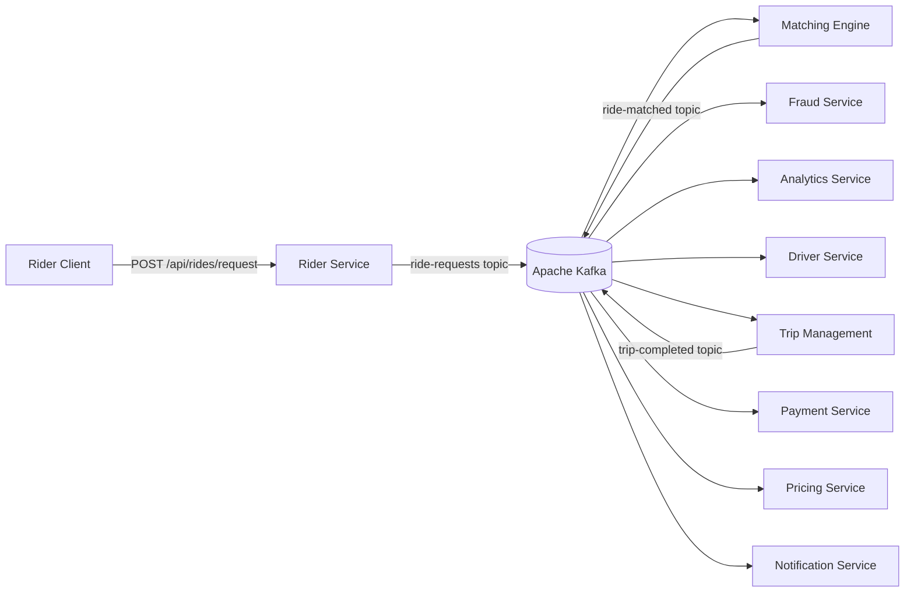

# Event-Driven Ride-Sharing Backend

A distributed backend platform for ride-sharing, built with **Python**, **FastAPI**, and **Apache Kafka**. Each business domain is an independently deployable microservice that communicates exclusively through Kafka events — no direct service-to-service calls.


---

## What This Is

A backend system that handles the full ride lifecycle — from a rider submitting a request to trip completion, payment, and fraud detection — using asynchronous, event-driven communication between services.

Built to demonstrate real distributed systems patterns: idempotent producers, fault-isolated services, concurrent event processing, and reliable state transitions across a Kafka-backed architecture.

---

## Architecture



**Flow:**
1. Rider submits a request → **Rider Service** validates and publishes to `ride-requests` topic
2. **Matching Engine** consumes the event, finds an available driver, publishes to `ride-matched`
3. **Driver Service** and **Trip Management** consume the match event and update state
4. On trip completion, **Payment** and **Pricing** services settle the transaction
5. **Fraud Service** and **Analytics** consume events independently throughout
6. **Notification Service** sends updates to rider and driver at each stage

---

## Services

| Service | Responsibility | Key Tech |
|---|---|---|
| `rider-service` | Accepts ride requests, validates input, publishes to Kafka | FastAPI, confluent-kafka |
| `driver-service` | Manages driver availability and location state | FastAPI, PostgreSQL |
| `matching-engine` | Consumes ride requests, matches to nearest available driver | Python, Kafka Consumer |
| `trip-management` | Owns trip lifecycle state machine from request to completion | FastAPI, PostgreSQL |
| `payment-service` | Processes payments on trip completion events | FastAPI, PostgreSQL |
| `pricing-service` | Calculates dynamic fare based on ride type and demand | Python |
| `fraud-service` | Monitors event stream for suspicious patterns | Python, Kafka Consumer |
| `notification-service` | Delivers real-time alerts to riders and drivers | Python, Kafka Consumer |
| `analytics-service` | Consumes all events for reporting and observability | Python, Kafka Consumer |
| `infra` | Docker Compose setup for Kafka, Zookeeper, Schema Registry | Docker |

---

## Key Design Decisions

**Idempotent Kafka Producer**
The rider service uses `enable.idempotence: True` with `acks: all`, ensuring exactly-once delivery semantics even under retries. Combined with exponential backoff retry logic, messages are never lost or duplicated on transient failures.

**No Direct Service Calls**
Services never call each other via HTTP. All coordination happens through Kafka topics. This means any single service can fail, restart, or scale independently without affecting others.

**Fault Isolation**
Each consumer group processes events at its own pace. A slow fraud check does not block payment processing — they consume from the same topic independently.

**Ride Types**
Supports `STANDARD`, `PREMIUM`, and `POOL` ride types, with pricing and matching logic scoped per type.

---

## Tech Stack

| Layer | Technology |
|---|---|
| API Framework | FastAPI |
| Message Broker | Apache Kafka (Confluent 7.6.1) |
| Schema Registry | Confluent Schema Registry |
| Database | PostgreSQL |
| Containerization | Docker, Docker Compose |
| Language | Python 3.11 |
| Kafka Client | confluent-kafka-python |
| Validation | Pydantic v2 |

---

## Getting Started

### Prerequisites
- Docker and Docker Compose installed
- Python 3.11+

### 1. Start the Infrastructure

```bash
cd infra
docker-compose up -d
```

This starts:
- **Zookeeper** on port `2181`
- **Kafka broker** on port `9092`
- **Schema Registry** on port `8081`

### 2. Run a Service

Each service is independently runnable. Example with rider-service:

```bash
cd rider-service
pip install -r requirements.txt
uvicorn app:app --reload --port 8000
```

### 3. Submit a Ride Request

```bash
curl -X POST http://localhost:8000/api/rides/request \
  -H "Content-Type: application/json" \
  -d '{
    "rider_id": "rider_001",
    "pickup_lat": 40.7128,
    "pickup_lon": -74.0060,
    "destination_lat": 40.7580,
    "destination_lon": -73.9855,
    "ride_type": "STANDARD"
  }'
```

**Response:**
```json
{
  "status": "OK",
  "message": "Ride request submitted",
  "rider_id": "rider_001",
  "timestamp": 1719360000000
}
```

---

## API Endpoints

| Service | Method | Endpoint | Description |
|---|---|---|---|
| rider-service | `POST` | `/api/rides/request` | Submit a new ride request |

---

## Project Structure

```
kafka-ride-sharing/
├── infra/
│   └── docker-compose.yml       # Kafka, Zookeeper, Schema Registry
├── rider-service/
│   ├── app.py                   # FastAPI app — POST /api/rides/request
│   ├── models.py                # RideRequest Pydantic model
│   └── kafka_producer.py        # Idempotent producer with retry logic
├── driver-service/              # Driver availability management
├── matching-engine/             # Rider-to-driver matching logic
├── trip-management/             # Trip lifecycle state machine
├── payment-service/             # Payment processing on completion
├── pricing-service/             # Dynamic fare calculation
├── fraud-service/               # Event stream fraud monitoring
├── notification-service/        # Rider and driver alerts
└── analytics-service/           # Event consumption for reporting
```

---

## What I Built

This project focuses on the backend engineering challenges that make distributed systems hard in production:

- **Reliable message delivery** under partial failures (idempotent producer, exponential backoff)
- **Independent scalability** — each service scales without coordination
- **State consistency** across services using event sourcing over shared Kafka topics
- **Clean domain separation** — no shared databases between services

---

## Future Roadmap

- [ ] Add Kubernetes manifests for production deployment
- [ ] Implement a dead-letter queue (DLQ) for failed message handling
- [ ] Add distributed tracing with OpenTelemetry and Jaeger
- [ ] Replace Zookeeper with KRaft (Kafka's native consensus layer)
- [ ] Add a WebSocket gateway for real-time ride status updates to clients
- [ ] Implement circuit breaker pattern for inter-service resilience
- [ ] Build a Grafana + Prometheus monitoring dashboard
- [ ] Add end-to-end integration tests with Testcontainers

---

## Contributing

Contributions are welcome. To contribute:

1. Fork the repository
2. Create a feature branch:
   ```bash
   git checkout -b feature/your-feature-name
   ```
3. Commit your changes:
   ```bash
   git commit -m "Add: your feature description"
   ```
4. Push and open a Pull Request:
   ```bash
   git push origin feature/your-feature-name
   ```

Please keep PRs focused on a single concern and include a clear description of what you changed and why.

---

## Join the Community

Have ideas, questions, or feedback? Feel free to:

- Open an [Issue](https://github.com/Vidhya060501/kafka-ride-sharing/issues) for bugs or feature requests
- Start a [Discussion](https://github.com/Vidhya060501/kafka-ride-sharing/discussions) for architecture questions or suggestions
- Connect on [LinkedIn](https://www.linkedin.com/in/vidhyadharibandaru) for collaboration

---

## Acknowledgements

- [Apache Kafka](https://kafka.apache.org/) — the backbone of the event-driven architecture
- [Confluent](https://www.confluent.io/) — for the Kafka Docker images and Schema Registry
- [FastAPI](https://fastapi.tiangolo.com/) — for the clean, async-friendly API framework
- [confluent-kafka-python](https://github.com/confluentinc/confluent-kafka-python) — Kafka client library
- [Pydantic](https://docs.pydantic.dev/) — for request validation and data modelling

---

## License

This project is licensed under the [MIT License](LICENSE).

---

<p align="center">
  Built by <a href="https://github.com/Vidhya060501">Vidhyadhari Bandaru</a> · 
  <a href="https://www.linkedin.com/in/vidhyadharibandaru">LinkedIn</a> · 
  <a href="mailto:vidhyadhari060501@gmail.com">Email</a>
</p>
